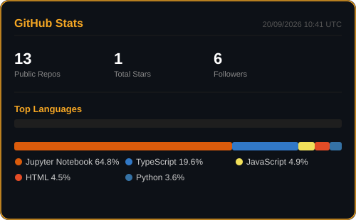

  
  
  
  

---

### ◆ &nbsp;Tech Stack

  
  
  
  
  
  
  

---

 

---

<picture>
  <source media="(prefers-color-scheme: dark)" srcset="https://raw.githubusercontent.com/LucasCosendey1/LucasCosendey1/main/dist/github-snake-dark.svg"/>
  
</picture>

---

> *"Bom software não é luxo — é a diferença entre uma ideia que fica no papel e um negócio que cresce."*

---

